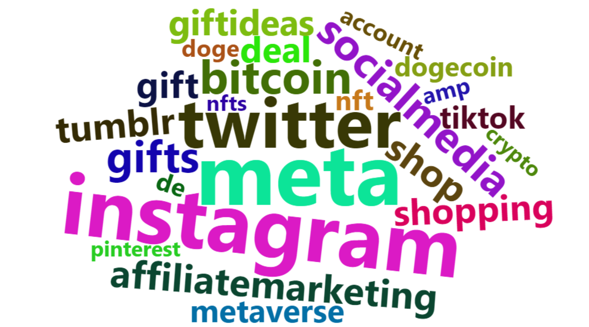

## textual-analysis
### Analysis of tweets about Facebook/Meta

Textual analysis is important for businesses to understand what the audience talk about the company, and most importantly, if they talk about it positively or negatively. This is a great tool to use after marketing campaigns to understand if people liked it or not. To practice, I use a dataset containing 2000 most recent tweets with the hashtag #facebook and #meta to address the following questions:
1. Which words are most commonly used in the dataset?
2. Do we find anything interesting when looking at a word cloud of the data?
3. What are the most common sentiments in the tweets?

Before we get started, I tokenized the words and removed the stop words, which are the words, that do not give much information, such as "the", "a", "and", etc

```
data_tidy <- data %>%
  tidytext::unnest_tokens(word, text, token = "words") 

data_tidy <- data_tidy %>%
  select(user_id, word) %>%
  anti_join(tidytext::stop_words) %>%
  filter(!grepl('t.co|https', word))
```
After which, we are ready to answer to the questions.
1. With the following code, I found that inthis dataset the most commonly used words are the following:
```
data_count <- data_tidy %>%
  group_by(word) %>%
  summarize(n=n()) %>%
  slice_max(order_by = n, n = 25) %>%
  arrange(desc(n))
  ```

| word | number of mentions | 
| :---:         |     :---:      |         
| facebook   | 1546     | 
| meta     | 755       | 
| instagram   | 742     | 
| twitter     | 614       |
| bitcoin   | 407     | 
| socialmedia     | 385       | 
| gifts   | 381     | 
| affiliatemarketing     | 339       | 
| shop   | 339     | 
| tumblr     | 326       | 

 2. To make the word cloud I installed "worldcloud2" and "RColorBrewer" packages
```
install.packages("RColorBrewer")
library(RColorBrewer)
install.packages("wordcloud2")
library(wordcloud2)

wordcloud2(data=data_count, size=1.6, color='random-dark')
```

From the world cloud we can see that people talk a lot about crypto currencies like bitcoin, dogecoin, nft, etc, because these are the most popular words after social media platform names(facebook, meta, etc).


3. Finally, we need to understand the common sentiments of the tweets.

```
data_tidy_nrc <- data_tidy %>%
  group_by(user_id, word) %>%
  summarise(n = n()) %>%
  tidytext::bind_tf_idf(word, user_id, n) %>%
  inner_join(
    tidytext::get_sentiments("nrc")) %>%
  ungroup()

data_tidy_sent <- data_tidy_nrc %>%
  group_by(sentiment) %>%
  summarize(n= n()) %>%
  arrange(desc(n))
```
| emotion | number of tweets | 
| :---:         |     :---:      |         
| positive   | 940     | 
| trust     | 502       | 
| negative   | 458     | 
| anticipation     | 431       |
| joy   | 322     | 
| fear     | 258       | 
| anger   | 207     | 
| sadness     | 194       | 
| surprise   | 170     | 
| disgust     | 116       | 

As we can see most of the tweets are positive, which means that these people like the application. 


